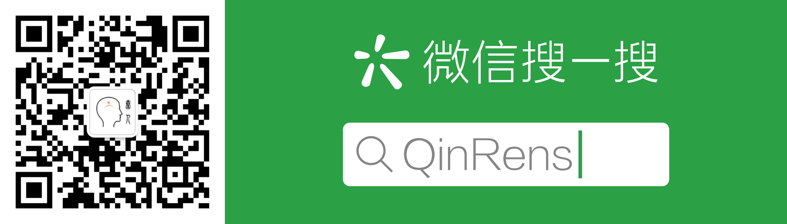

# [秦人团队](http://qinren.tech/)规范书 v1.0

为了统一规范工程及代码风格从而保证团队协同工作效率，[秦人](http://qinren.tech/)制定并执行如下1.0版本规范。

## 规范整体架构

1. [基本工程管理规范](project/)
	+ [工程架构](project/#_2)
	+ [工程文档](project/#_5)
2. [基本代码管理规范](/code)
	+ [Python](code/#python)
	+ [Matlab](code/#matlab)
3. 应用详细规范
	+ Python爬虫
	+ Python机器学习——Tensorflow
	+ Matlab —— Simulink
	+ 网站代码管理
	+ 大数据Hadoop/Flask管理
4. 其他方面
	+ 服务器管理
	+ 秦人网页/微信公众号/Github管理

## 其他

1. 如何参与秦人规范制定？
	
	答：通过Github，将您的意见pull request到[这里](https://github.com/QinRens/qinren-standard-web)。

2. 想要进一步了解秦人团队？

	答：以下是我们的联系方式：

	+ [官方网页](http://qinren.tech/)：http://qinren.tech/
	+ [Github](https://github.com/QinRens): https://github.com/QinRens
	+ 微信公众号搜索：QinRens
	

3. 想要加入秦人团队？

	答：非常欢迎优秀的你，快来我们的[招聘页](http://qinren.tech/recruitment/index.html)看看吧！http://qinren.tech/recruitment/index.html
