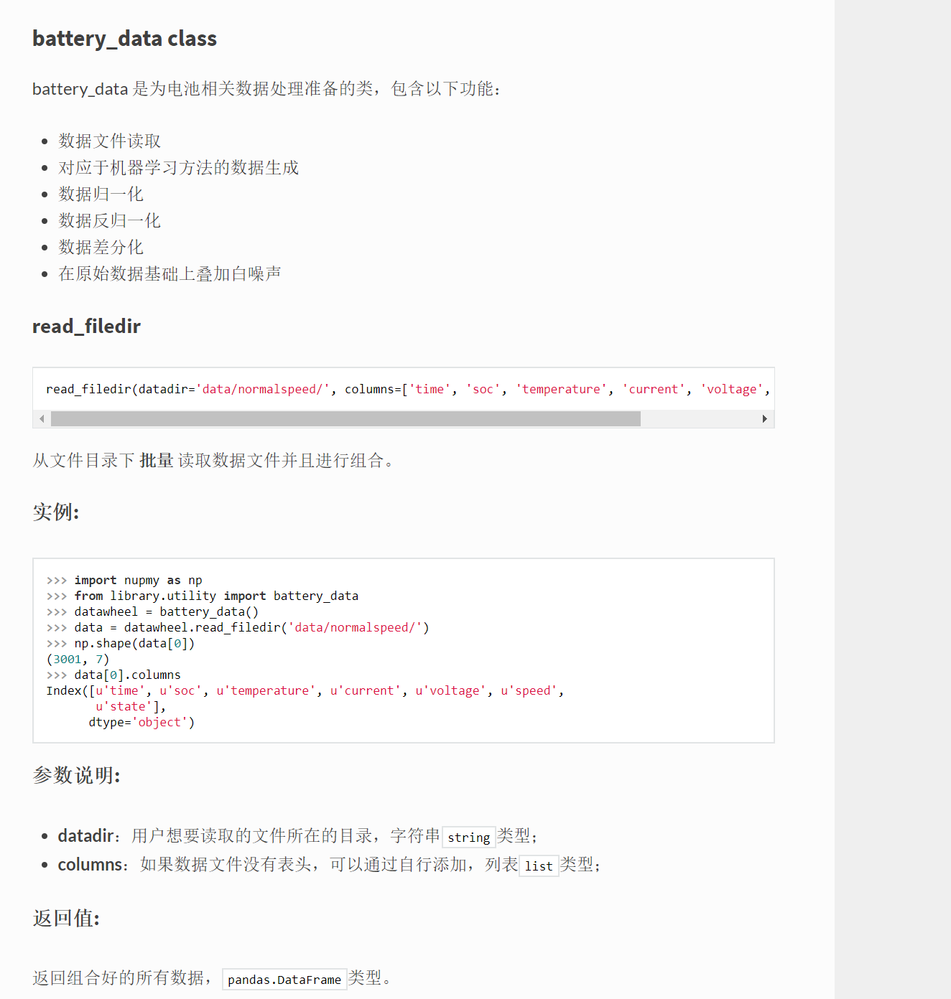

# 基本工程管理规范

秦人团队开发应用及研究程序以 __工程__ 为单位，工程管理有助于个人及团队开发和维护，这里从两个方面详述基本工程管理规范：

+ [工程架构](#_2)
+ [工程文档](#_5)

## 工程架构

工程架构设计应遵从如下要求：

1. 顶层设计
2. 模块化
3. 易读性

以Python工程为例进行展开说明，如下是规范的工程树：

```
README.md 				# 简要说明该工程文件背景、目标、功能、运行环境要求
requirements.txt 		# 说明运行本工程所需要的全部包以及版本号
.gitignore				# 写明了Github版本控制中需要忽略的文件
main.py 				# 主程序
library/				# 存放用来调用的库文件
	__init__.py 		# init文件，实现外部main.py链接到library
	name_of_package1/ 	# 存放第一个包
	name_of_package2/	# 存放第二个包
	...
data/					# 存放程序调用的数据文件
result/					# 存放程序运行结果
docs/ 					# 工程的详细文档说明
test/ 					# 测试工程用到的代码
ref/ 					# 工程当中引用到的相关文件
example/				# 工程的范例
LICENSE					# 工程的license文件
```

### 必需部分

#### 1. README.md

```README.md```是以markdown语言书写的关于工程的简要介绍，包含部分：

+ 版本号；
+ 工程背景；
+ 实现功能简要介绍；
+ 如何实现工程的一个简单并且有代表性的功能，包括部分代码（例如如何在命令行状态下运行程序）及输入输出解释；
+ 运行环境要求。

#### 2. requirements.txt

```requirements.txt```文件中应该包含运行工程所需要的全部依赖包及其版本号，那么

1.如何生成requirements.txt：
```bash
(venv) $ pip freeze >requirements.txt
```
2.如何安装requirements.txt中的所有包：
```bash
(venv) $ pip install -r requirements.txt
```

#### 3 .gitignore

```.gitignore```文件中说明了Git版本控制中需要忽略的文件（也就是git status不会看到的文件），
例如python的编译文件.pyc、jupyter notebook的.ipynb_checkpoint等文件均可以忽略，模板如下：

```
*pyc
*/.ipynb_checkpoint
.gitignore
```

#### 4 main.py

```main.py```文件是工程的主程序，具体规范参照这里。

#### 5. library/

```library/```文件夹下包含了该工程的全部函数和类模块，遵从模块化、封装化的规则。
除了代码部分，需要包含```library/README.md```、```library/name_package1/README.md```等文件，
说明文件层级信息，以及各个包实现功能。
具体规范参照[这里](#2-libraryapi)。

#### 6. data/

```data/```用于存放与工程相关的数据文件，最好归类存放。

#### 7. result/

```result/```存放结果文件。

#### 8. docs/

```docs/```存放工程文档，具体规范参照[这里](#_5)。

### 可选部分

#### 1. test/

```test/```存放测试文件。

#### 2. ref/

```ref/```存放参考文献。

#### 3. example/

```example```存放运行工程的范例代码，必须测试通过，可以是```jupyter notebook```的形式，
代码+解释。

#### 4. LICENSE/

```LICENSE```文件，说明工程的授权许可，在未正式公布上线前的工程中，可以不包含该文件。

## 工程文档

工程文档统一使用[```mkdocs```](https://www.mkdocs.org/)书写，主题推荐采用本代码规范的```theme/```文件夹下的所有文件，相关个性化设置可以自行修改。推荐文档包含以下内容：

### 主页介绍

对于用户来说，读完你的介绍后应该达到以下几点效果：
+ 知道这个工程做了什么；
+ 优势所在；
+ 如何快速使用/实现简单但是核心的功能（可以使用相对简化模型）；
+ 其他。

所以，主页介绍要包括以下方面：

+ 介绍该工程实现了什么功能，用户可以用它来做什么，以及有哪些特色和亮点；
+ 设计指导原则：
	+ 用户友好（展开说明）
	+ 模块化（展开说明）
	+ 易于拓展（展开说明）
	+ 用什么工具实现（展开说明）
+ 快速上手你的工程代码；
+ 核心依赖包（不同于requirements.txt，而是核心的依赖包）；
+ 工程结构树（注明每个部分的用途）；
+ 其他（根据情况书写）。

### library的API

API书写层级遵从“先类后方法”等原则，具体以```battery_data class```为例：



需要包含的说明有：

+ 介绍当前```class```实现了什么功能；
+ 方法一：
	+ 函数名称，包含的参数；
	+ 实例（在命令行中运行一个 __正确简单__ 的示例），并且展示结果；
	+ 参数说明：
		+ 参数一：参数解释，类型；
		+ ...
	+ 返回值：
		+ 参数一：参数解释，类型；
		+ ...
	+ 引用；
+ 方法二：
	+ 同上。

### 其他

文档中可以包含：

+ 结果分析；
+ 一些异常情况的说明；
+ 调试日志；
+ 其他根据情况整理。